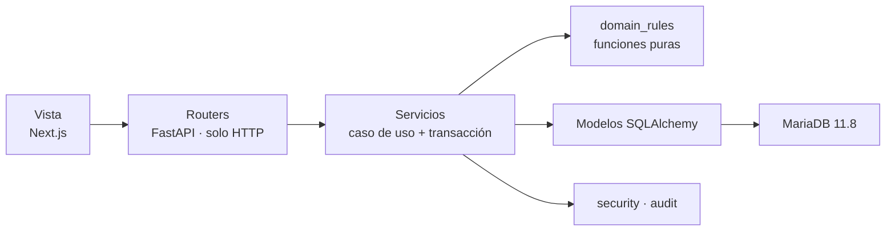

# Kawsay v0.2.0 — Plan revisado (routers, CI y brechas reales)

> **Estado:** revisión crítica del plan "Arquitectura MVC por capas" contra el código real de `v0.1.0`.
> **Veredicto:** el diagnóstico central es correcto (`main.py` es demasiado grande), pero la solución
> propuesta estaba dimensionada para un monolito legado de decenas de miles de líneas, no para este
> proyecto. Este documento reemplaza el plan original con uno proporcionado al tamaño real del código.

---

## 0. Tamaño real del proyecto (medido, no estimado)

| Área | Líneas | Comentario |
|---|---:|---|
| `backend/app/main.py` | 733 | **El problema real.** 26 endpoints en un archivo. |
| Resto de `backend/app/` sin modelos | 538 | `api_contracts` 214, `tasks` 99, `domain_rules` 65, `security` 65, `config` 35, `dependencies` 34, `database` 24 |
| `backend/app/models/` | 1 279 | 62 tablas, ya bien separadas por dominio |
| `backend/tests/` | 285 | 7 archivos |
| `frontend/app/` (código propio) | 451 | 12 archivos, ninguno supera 103 líneas |
| `frontend/components/ui/` | 7 565 | shadcn/ui generado; no es código de autoría |

**Lógica de aplicación no-modelo del backend: 1 271 líneas.**

El plan original proponía **~51 archivos nuevos** (9 controladores + 10 servicios + 10 repositorios +
8 schemas + 3 dominio + 3 dependencias + 3 seguridad + 4 core + runner), más módulos de compatibilidad
temporal. Eso da un promedio de **~25 líneas por archivo** y multiplica por 6 el número de archivos del
backend. Es sobreingeniería medible, no una opinión de estilo.

---

## 1. Verificación de las afirmaciones del plan original

| Afirmación original | Realidad verificada | Efecto |
|---|---|---|
| `main.py` ≈ 665 líneas con 26 operaciones | **733 líneas, 26 endpoints** — correcto | ✅ Se conserva el diagnóstico |
| 62 tablas, FULLTEXT, VECTOR, vista, triggers | Verificado en `0001_initial_schema.py` y `models/` | ✅ |
| `dependencies.py` "mezcla responsabilidades" | **34 líneas**; es FastAPI idiomático | ❌ Dividirlo no mejora nada |
| `domain_rules.py` debe partirse en 3 archivos | **65 líneas, 7 funciones** | ❌ Churn puro |
| `security.py` debe partirse en 3 archivos | **65 líneas** | ❌ Churn puro |
| `finanzas/page.tsx` "mezcla carga, formularios, estado, errores, mutaciones y presentación" | **31 líneas** | ⚠️ El problema es otro (ver §5) |
| Falta batería de pruebas frontend | Correcto: no hay Vitest, RTL ni Playwright | ✅ pero con alcance reducido |
| `VERSION`=0.1.0 vs FastAPI `version="0.2.0"` | Verificado | ✅ |
| "Conservar el checksum de `0001_initial_schema.py`" | **La migración es `Base.metadata.create_all()`** | ❌ Criterio inútil (ver §4.1) |
| "Todas las pruebas actuales pasan" | `test_schema_static.py` hace `grep` de rutas dentro de `main.py` | ❌ Criterio imposible (ver §4.2) |
| No existe CI | Confirmado: **no hay `.github/`** | ❌ El plan lo exige como criterio pero nunca como tarea |

---

## 2. Lo que se conserva del plan original

Estas decisiones eran correctas y se mantienen sin cambios:

1. **Partir `main.py`.** Es el problema real y urgente.
2. **Congelar el comportamiento observable antes de mover código** mediante snapshot de OpenAPI.
3. **`core/exceptions.py`**: los servicios no deben construir `HTTPException`; un manejador global traduce.
4. **Pruebas de acceso horizontal con dos usuarias.** Es la adición de mayor valor de todo el plan.
5. **Congelar la recuperación RAG basada en `LIKE`.** No mezclar refactor con cambio funcional.
6. **Posponer la migración de `sessionStorage` a cookies.** Alcance correcto.
7. **Mantener `app = create_app()`** para no romper `uvicorn app.main:app` ni Docker.
8. **Sincronizar versiones solo al cierre.**
9. **Detectar la carrera de `sequence_number`** en mensajes — es real y produce un 500 bajo concurrencia.

---

## 3. Lo que se elimina del plan original y por qué

### 3.1 Capa de repositorios — se elimina completa

SQLAlchemy 2 ORM ya es la capa de acceso a datos. Añadir 10 repositorios encima crea una segunda
abstracción sobre una abstracción, para 26 endpoints cuyas consultas son de 1 a 5 líneas.
Ejemplo real, `list_businesses` completo:

```python
return list(db.scalars(select(Business).where(
    Business.owner_user_id == user.id, Business.deleted_at.is_(None)
).order_by(Business.created_at.desc())))
```

Envolver esto en `business_repository.list_owned(user_id)` no aporta testabilidad (las pruebas reales
deben correr contra MariaDB por `VECTOR`, `FULLTEXT`, vista y triggers — el propio plan lo dice) ni
portabilidad (no hay intención de dejar MariaDB).

**Decisión:** los servicios reciben `Session` y consultan directamente. Se reevalúa en v0.3.0 solo si
aparece duplicación real de consultas.

### 3.2 División de `domain_rules.py`, `security.py`, `config.py`, `database.py`, `dependencies.py`

Suman **223 líneas**. Dividirlas en 12 archivos más 4 módulos de compatibilidad temporal genera trabajo,
riesgo de importación cíclica y ruido en el diff, sin ningún beneficio de legibilidad.
**Se quedan donde están.** `api_contracts.py` (214 líneas) se dividirá solo si supera ~350 líneas.

### 3.3 Árbol `features/{api,hooks,types,components}` del frontend

Todo el código propio del frontend son **451 líneas en 12 archivos**. La estructura propuesta produciría
más archivos que unidades reales de código. El problema del frontend es otro (§5, punto 11 y §7 Fase D).

### 3.4 Playwright

Un frontend de 451 líneas con 6 pantallas no justifica todavía una infraestructura E2E.
**Se pospone a v0.3.0.** Se conserva Vitest para el único módulo con lógica real: `lib/api.ts`.

### 3.5 De 11 fases a 5

Las fases 2 a 9 del plan original mueven en promedio ~40 líneas cada una. La Fase 2
("emprendimientos como módulo piloto") mueve **18 líneas de endpoint**. Ocho fases con commit,
verificación de OpenAPI, revisión de acceso horizontal y smoke test de Docker cada una es ceremonia
desproporcionada al riesgo.

---

## 4. Dos criterios de aceptación del plan original que estaban rotos

### 4.1 "`0001_initial_schema.py` conserva su contenido y checksum"

La migración **no declara tablas**: ejecuta `Base.metadata.create_all(bind=bind)` y después el DDL
específico de MariaDB. El esquema producido proviene de `app/models/`, no del archivo.
El checksum puede quedar idéntico mientras el esquema cambia por completo.

**Reemplazo:** huella del esquema real. Volcar de `information_schema` las tablas, columnas, tipos,
índices, restricciones, vistas y triggers a `tests/contracts/schema_v0_1.json` antes del refactor y
compararlo después. Eso sí detecta una regresión de esquema.

### 4.2 "Todas las pruebas actuales y nuevas pasan"

`backend/tests/test_schema_static.py::test_api_contract_routes_are_present` lee `main.py` como texto y
busca literales de ruta:

```python
main = (ROOT / "app" / "main.py").read_text(encoding="utf-8")
for route in ("/businesses", "/consents", "/finance/movements", ...):
    self.assertIn(route, main)
```

Esta prueba **falla necesariamente** en cuanto las rutas salgan de `main.py`. El plan la daba por
compatible. **Debe reescribirse en la Fase A** para consultar `app.openapi()` en vez de leer el archivo.

---

## 5. Lo que faltaba en el plan original

Ordenado por valor entregado frente a esfuerzo. Todo esto rinde más que la capa de repositorios.

| # | Brecha | Evidencia | Esfuerzo |
|---|---|---|---|
| 1 | **No hay CI.** `test_mariadb_integration.py` se salta sin `TEST_DATABASE_URL`, así que la única prueba que toca MariaDB nunca corre | no existe `.github/` | 1 archivo |
| 2 | **Secretos por defecto sin guardia.** `config.py` trae `"replace-with-a-fernet-key"` y `"replace-with-at-least-32-random-characters"`; `docker-compose.yml` los fija en literales. Nada impide arrancar en producción con ellos | `config.py` | ~6 líneas |
| 3 | **El frontend nunca renueva el token.** `refresh_token` se guarda pero jamás se usa; no hay manejo de 401. Con TTL de 15 min la usuaria queda fuera sin aviso | `frontend/app/lib/api.ts` completo | ~20 líneas |
| 4 | **Sin límite de intentos** en `/auth/login` ni `/auth/verify-contact`. Argon2id no protege contra intentos ilimitados | `main.py` `login()` | ~30 líneas |
| 5 | **Enumeración de cuentas.** `/auth/register` responde 409 "El contacto ya está registrado". El propio plan exige que nadie "descubra su existencia mediante diferencias de respuesta" y a la vez ordena congelar ese 409 | `main.py` `register()` | contradicción interna |
| 6 | **Regla de dominio duplicada y muerta.** `validate_transfer` existe en `domain_rules.py` **y** como `model_validator` en `FinancialMovementCreate`, con mensajes distintos. Pydantic gana, así que la versión de dominio nunca se ejecuta en la ruta HTTP | `domain_rules.py` vs `api_contracts.py` | elegir un hogar |
| 7 | **`financial_summary` reimplementa la regla de saldo en línea** con un `if/elif` en vez de llamar a `movement_balance_effect`, y omite `TRANSFER` | `main.py` `financial_summary()` | ~5 líneas |
| 8 | **Funciones de dominio probadas pero nunca usadas:** `movement_balance_effect`, `audio_purge_deadline`, `optional_feature_allowed`. El plan las repartía en 3 archivos sin notar que 3 de 7 están desconectadas | los imports de `main.py` no las incluyen | decisión |
| 9 | **`datetime.utcnow()` obsoleto** en `main.py` y `tasks.py`, mientras `security.py` usa `datetime.now(UTC)`. Conviven fechas naive y aware | `main.py`, `tasks.py` | `core/clock.py` |
| 10 | **Asignación masiva.** `Business(owner_user_id=user.id, **payload.model_dump())`. Seguro hoy, inseguro en cuanto `BusinessCreate` gane un campo | `main.py` `create_business()` | 1 línea |
| 11 | **Andamiaje roto en el frontend.** `vite.config.ts` importa `@openai/sites-vite-plugin`, `vinext` y `@cloudflare/vite-plugin`; ninguno está en `package.json`. Junto con `.openai/hosting.json` es residuo de otro generador dentro de un proyecto Next.js | `frontend/vite.config.ts` | borrar |
| 12 | **`npm run lint` no es un lint:** es `tsc --noEmit`. Existen `.oxlintrc.json` y `.oxfmtrc.json` pero `oxlint`/`oxfmt` no son dependencias. El plan ordena "ejecutar `npm run lint`" creyendo que analiza | `package.json` | 2 dependencias |
| 13 | **Esquema vectorial inerte.** `source_chunk_embeddings`, `VECTOR(768)`, `idx_chunk_embedding` y la fila sembrada en `embedding_models` existen, pero nada escribe ni lee embeddings. Congelar RAG en `LIKE` es correcto; falta **documentar que el esquema vectorial queda dormido a propósito** | migración inicial | 1 nota |

---

## 6. Arquitectura objetivo revisada

Tres capas, no cinco. Sin repositorios y sin módulos de compatibilidad.



```text
backend/app/
├── main.py                  # create_app(): CORS, exception handlers, include_router  (~60 líneas)
├── core/
│   ├── exceptions.py        # AppError · NotFound · Conflict · Forbidden · Invalid
│   └── clock.py             # utc_now() único
├── routers/
│   ├── system.py            # /health
│   ├── auth.py              # /auth/*
│   ├── account.py           # /me
│   ├── businesses.py        # /businesses
│   ├── finance.py           # /finance/*
│   ├── assistant.py         # /conversations, /assistant/query, /feedback
│   ├── privacy.py           # /consents, /privacy/*
│   └── sources.py           # /sources, /source-versions, /source-chunks
├── services/
│   ├── auth_service.py
│   ├── business_service.py
│   ├── finance_service.py
│   ├── assistant_service.py
│   ├── privacy_service.py
│   ├── source_service.py
│   ├── audit_service.py
│   └── authorization.py     # assert_permission, owned_business
├── api_contracts.py         # SIN CAMBIOS
├── domain_rules.py          # SIN CAMBIOS de ubicación; se limpia la duplicación
├── security.py              # SIN CAMBIOS
├── dependencies.py          # SIN CAMBIOS
├── config.py                # + validador de secretos por defecto
├── database.py              # SIN CAMBIOS
├── models/                  # SIN CAMBIOS
└── tasks.py                 # SIN CAMBIOS en v0.2.0
```

**18 archivos nuevos en vez de ~51.**

### Reglas de capa (verificadas por `tests/test_architecture.py`)

- Los routers no importan `select`, `Session` ni modelos SQLAlchemy.
- Los routers no hacen `commit`, `flush` ni `refresh`.
- Los servicios no importan `fastapi`; señalan errores con subclases de `AppError`.
- Los servicios son dueños de la transacción: un `commit` por caso de uso.
- `domain_rules.py` solo importa la biblioteca estándar.
- Toda consulta privada filtra por `user_id`, propiedad o membresía.

### Traducción de errores

Un único manejador en `main.py`:

```python
@app.exception_handler(AppError)
def handle_app_error(request, exc: AppError):
    return JSONResponse(status_code=exc.status, content={"detail": exc.detail})
```

Los textos de `detail` se conservan literalmente: el frontend los muestra tal cual al usuario.

### Descomposición interna de `assistant_query`

Es la única función que la necesita de verdad (94 líneas). Se descompone **dentro de
`assistant_service.py`**, no repartida en cuatro archivos:

```python
def answer_query(db, user, payload) -> AssistantQueryResponse:
    conversation = _resolve_conversation(db, user, payload)
    _persist_user_message(db, conversation, payload.message)
    normative, terms = _classify(payload.message)
    evidence = _retrieve_published(db, terms)
    answer, warning, abstained = _compose(evidence, normative)
    validate_normative_response(...)
    citations = _persist_run(db, conversation, answer, warning, abstained, evidence)
    db.commit()
    return AssistantQueryResponse(...)
```

---

## 7. Plan por fases

### Fase A — Red de seguridad (prerrequisito real)

Sin esto, ninguna fase posterior es verificable.

1. **`.github/workflows/ci.yml`**: servicio MariaDB 11.8, `alembic upgrade head`,
   `pytest` **con `TEST_DATABASE_URL` definido** para que `test_mariadb_integration` deje de saltarse,
   `ruff check`, `tsc --noEmit`, `next build`.
2. **Snapshot de contrato**: `tests/contracts/openapi_v0_1.json` desde `app.openapi()`, más una prueba
   que compare rutas, métodos, códigos de estado y schemas.
3. **Huella de esquema**: `tests/contracts/schema_v0_1.json` desde `information_schema`
   (tablas, columnas, tipos, índices, restricciones, vistas, triggers). Sustituye al checksum del archivo.
4. **`tests/test_http_smoke.py`** contra MariaDB: registro → verificación → login → negocio → movimiento →
   resumen → asistente → consentimiento → exportación.
5. **`tests/test_horizontal_access.py`**: dos usuarias; cada acceso cruzado a `business_id`, movimiento,
   conversación, mensaje y feedback debe devolver 404, nunca 200 ni un 403 informativo.
6. **Reescribir `test_schema_static.py::test_api_contract_routes_are_present`** para consultar
   `app.openapi()` en lugar de leer `main.py` como texto.

Commit: `test: red de seguridad y contrato observable de v0.1.0`

### Fase B — Partir `main.py`

1. `core/exceptions.py` y `core/clock.py`.
2. `services/` — extraer la lógica; los servicios reciben `Session` y son dueños del `commit`.
3. `routers/` — 8 `APIRouter`; solo HTTP, schemas y dependencias.
4. `main.py` → `create_app()` con CORS, manejador de `AppError` e `include_router`; se conserva
   `app = create_app()`.
5. `tests/test_architecture.py` con las reglas de §6.
6. Verificar el snapshot de OpenAPI **sin diferencias**.

Se hace en **dos commits**, no en ocho: uno para `services` + `core`, otro para `routers` + `main.py`.
El módulo de mayor riesgo (`assistant_service`) se revisa aparte contra las pruebas RAG.

Commits:
`refactor(backend): extrae servicios y excepciones de aplicación`
`refactor(backend): mueve endpoints a routers y convierte main.py en factoría`

### Fase C — Corregir lo que el congelamiento habría ocultado

Cambios de comportamiento **aprobados explícitamente** (§8), no incidentales:

1. Validador en `Settings`: rechazar el arranque si `jwt_secret` o `content_encryption_key`
   siguen en su valor por defecto y `app_env != "development"`. Añadir `.env.example`.
2. `/auth/register`: dejar de filtrar existencia. Responder siempre con el mismo mensaje genérico y
   emitir el desafío solo si el contacto es nuevo. **Cambio documentado de OpenAPI.**
3. Límite de intentos en `/auth/login` y `/auth/verify-contact` con retroceso progresivo.
   Las tablas `auth_challenges` y `security_alerts` ya existen.
4. Carrera de `sequence_number`: capturar `IntegrityError` sobre `uq_message_sequence` y reintentar una
   vez, o bloquear la fila de la conversación con `SELECT … FOR UPDATE`.
5. `core/clock.utc_now()` en todo el backend; eliminar `datetime.utcnow()`.
6. Un solo hogar para la regla de transferencia: conservar el `model_validator` de Pydantic (que es el
   que realmente se ejecuta) y eliminar `domain_rules.validate_transfer`, **o** al revés — pero no ambos.
7. `financial_summary` usa `movement_balance_effect`; se elimina el `if/elif` duplicado.
8. `create_business` con argumentos explícitos en lugar de `**payload.model_dump()`.
9. Decidir sobre `audio_purge_deadline` y `optional_feature_allowed`: conectarlas a `tasks.py` y a la
   pantalla de privacidad, o marcarlas como API prevista para v0.3.0.

Commit: `fix(backend): guardias de secretos, enumeración, concurrencia y reglas duplicadas`

### Fase D — Frontend: lo mínimo que rinde

1. Añadir `oxlint` y `oxfmt` a `devDependencies` (sus configuraciones ya existen);
   `"lint": "oxlint && tsc --noEmit"`.
2. **Reformatear** los archivos escritos como sentencias de una sola línea de 200+ columnas
   (`finanzas`, `asistente`, `privacidad`, `emprendimiento`). Este es el problema real de mantenibilidad
   del frontend, no la falta de carpetas `features/`.
3. `lib/api.ts`: ante 401, intentar `/auth/refresh` una vez, reintentar la petición y, si falla,
   `clearTokens()` y redirigir a `/login`. **Corrige la expulsión silenciosa a los 15 minutos.**
4. `frontend/types/api.ts`: un solo lugar para `Business`, `Movement`, `Summary`, `Category`, `Citation`
   (hoy redeclarados en 4 páginas).
5. Borrar `frontend/vite.config.ts` y `frontend/.openai/` — andamiaje roto de otro generador.
6. Vitest más una prueba de `lib/api.ts` (ruta de refresh y mapeo de errores). **Sin Playwright.**

Commit: `refactor(frontend): formato, tipos compartidos y renovación de sesión`

### Fase E — Cierre

- `VERSION`, `pyproject.toml`, `package.json` y `FastAPI(version=…)` → `0.2.0`.
- `CHANGELOG.md` con la lista de §8.
- `docker compose up --build` desde volumen limpio; probar `/health`, registro y login.
- PR `refactor/v0.2.0` → `main`, CI en verde.
- Etiqueta anotada `v0.2.0`.

Commit: `chore(release): versión 0.2.0`

**Total: 5 fases, 6 commits, ~18 archivos nuevos en el backend.**

---

## 8. Cambios de comportamiento aprobados

El plan original exigía compatibilidad observable absoluta, lo que habría congelado defectos reales.
Esta es la lista cerrada de diferencias intencionales frente a `v0.1.0`:

| Cambio | Antes | Después | Motivo |
|---|---|---|---|
| `/auth/register` con contacto existente | `409` + "El contacto ya está registrado" | `201` con mensaje genérico idéntico al caso nuevo | Enumeración de cuentas |
| `/auth/login` tras N intentos fallidos | sin límite | `429` con retroceso | Fuerza bruta |
| Arranque con secretos por defecto | permitido | falla si `app_env != "development"` | Despliegue inseguro |
| `/assistant/query` bajo concurrencia | `500` por colisión de secuencia | reintento transparente | Corrección |
| Frontend ante `401` | error visible, sesión perdida | renovación transparente | UX rota |

Todo lo demás —rutas, métodos, códigos, schemas, textos de `detail`, cálculos financieros, abstención,
advertencias, citas y `trace_id` del RAG— se conserva **idéntico**, y lo verifica el snapshot de OpenAPI.

---

## 9. Criterios de aceptación revisados

- [ ] Las 26 operaciones siguen expuestas; el diff de OpenAPI contiene **solo** los cambios de §8.
- [ ] La huella de `information_schema` es idéntica antes y después (62 tablas, índices, vista, triggers).
- [ ] `main.py` ≤ 80 líneas y solo compone la aplicación.
- [ ] Ningún router importa `sqlalchemy` ni `app.models`.
- [ ] Ningún router hace `commit`, `flush` ni `refresh`.
- [ ] Ningún servicio importa `fastapi`.
- [ ] `domain_rules.py` solo importa la biblioteca estándar.
- [ ] Cada consulta privada filtra por usuaria, propiedad o membresía.
- [ ] Las pruebas de acceso horizontal con dos usuarias pasan y devuelven 404 en todo acceso cruzado.
- [ ] Cada mutación crítica genera auditoría dentro de la misma transacción.
- [ ] **CI en verde con MariaDB 11.8 real; `test_mariadb_integration` ejecutado, no saltado.**
- [ ] `alembic upgrade head` → `downgrade base` → `upgrade head` sin errores.
- [ ] `oxlint`, `tsc --noEmit` y `next build` pasan.
- [ ] `docker compose up --build` levanta los tres servicios desde volumen limpio.
- [ ] Versiones sincronizadas en `0.2.0`.
- [ ] `CHANGELOG.md` documenta los cambios de §8.

Criterios **retirados** del plan original: checksum de la migración (§4.1) y compatibilidad total de las
pruebas existentes (§4.2).

---

## 10. Riesgos

| Riesgo | Medida |
|---|---|
| Cambio accidental de contrato al mover rutas | Snapshot de OpenAPI verificado en cada commit de la Fase B |
| `assistant_query` es la extracción más delicada | Se extrae sola, con pruebas RAG dedicadas antes y después |
| Regresión financiera | Casos con `Decimal` exacto reproducidos desde `test_domain_rules` |
| Transacción partida al mover el `commit` a servicios | Prueba de fallo intermedio: sin escrituras parciales |
| Romper Docker | Se conserva `app = create_app()` y `uvicorn app.main:app` |
| El cambio de `/auth/register` rompe el frontend | `registro/page.tsx` ya trata cualquier error como mensaje; se revisa el flujo con `verification_token` |
| Sobrecosto de la Fase A frente al valor del refactor | La Fase A es reutilizable para todas las versiones futuras; no es coste hundido |

---

## 11. Trabajo pospuesto a v0.3.0

Explícitamente fuera de alcance, para que nadie lo reintroduzca a mitad de camino:

- Capa de repositorios (reevaluar solo si aparece duplicación real de consultas).
- División de `api_contracts.py`, `security.py`, `domain_rules.py`, `config.py`, `database.py`.
- Árbol `features/` en el frontend y React Query / SWR / Zod.
- Playwright y pruebas E2E.
- Migración de `sessionStorage` a cookies `HttpOnly` + `SameSite`.
- Búsqueda híbrida o vectorial en RAG (el esquema `VECTOR(768)` queda **dormido a propósito**).
- Migraciones Alembic declarativas que reemplacen `Base.metadata.create_all()`.
- Refactor de `tasks.py` a servicio de retención más runner.

---

## 12. Comparación de esfuerzo

| | Plan original | Plan revisado |
|---|---:|---:|
| Fases | 11 | 5 |
| Commits previstos | 13 | 6 |
| Archivos nuevos en backend | ~51 | 18 |
| Módulos de compatibilidad temporal | 4 | 0 |
| Frameworks de prueba nuevos | 3 (Vitest, RTL, Playwright) | 1 (Vitest) |
| Defectos reales corregidos | 0 (congelados) | 9 |
| CI | criterio, sin tarea | Fase A, tarea 1 |

---

## 13. Checklist de ejecución

**Fase A**
- [ ] Crear rama `refactor/v0.2.0` desde `v0.1.0`.
- [ ] `.github/workflows/ci.yml` con MariaDB 11.8 y `TEST_DATABASE_URL`.
- [ ] Snapshot `tests/contracts/openapi_v0_1.json` más prueba comparadora.
- [ ] Huella `tests/contracts/schema_v0_1.json` desde `information_schema`.
- [ ] `tests/test_http_smoke.py`.
- [ ] `tests/test_horizontal_access.py` con dos usuarias.
- [ ] Reescribir `test_api_contract_routes_are_present` sobre `app.openapi()`.

**Fase B**
- [ ] `core/exceptions.py` y `core/clock.py`.
- [ ] 8 servicios; `commit` solo en servicios.
- [ ] Descomponer `assistant_query` dentro de `assistant_service.py`.
- [ ] 8 routers; `main.py` → `create_app()` ≤ 80 líneas.
- [ ] `tests/test_architecture.py`.
- [ ] Snapshot de OpenAPI sin diferencias.

**Fase C**
- [ ] Validador de secretos más `.env.example`.
- [ ] `/auth/register` sin enumeración.
- [ ] Límite de intentos en login y verificación.
- [ ] Reintento en colisión de `sequence_number`.
- [ ] `utc_now()` unificado.
- [ ] Regla de transferencia con un solo hogar.
- [ ] `financial_summary` usa `movement_balance_effect`.
- [ ] `create_business` sin asignación masiva.
- [ ] Decidir sobre las 3 funciones de dominio desconectadas.

**Fase D**
- [ ] `oxlint` y `oxfmt` en `devDependencies`; `npm run lint` real.
- [ ] Reformatear las páginas escritas en una sola línea.
- [ ] Renovación de token ante 401 en `lib/api.ts`.
- [ ] `frontend/types/api.ts` compartido.
- [ ] Borrar `vite.config.ts` y `.openai/`.
- [ ] Vitest más prueba de `lib/api.ts`.

**Fase E**
- [ ] Versiones a `0.2.0` en los cuatro lugares.
- [ ] `CHANGELOG.md` con los cambios de §8.
- [ ] `docker compose up --build` desde volumen limpio.
- [ ] PR, CI en verde, etiqueta `v0.2.0`.
