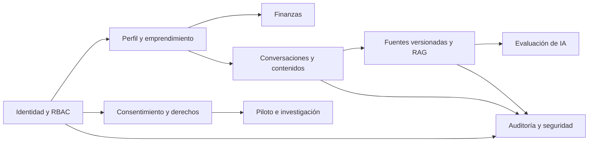
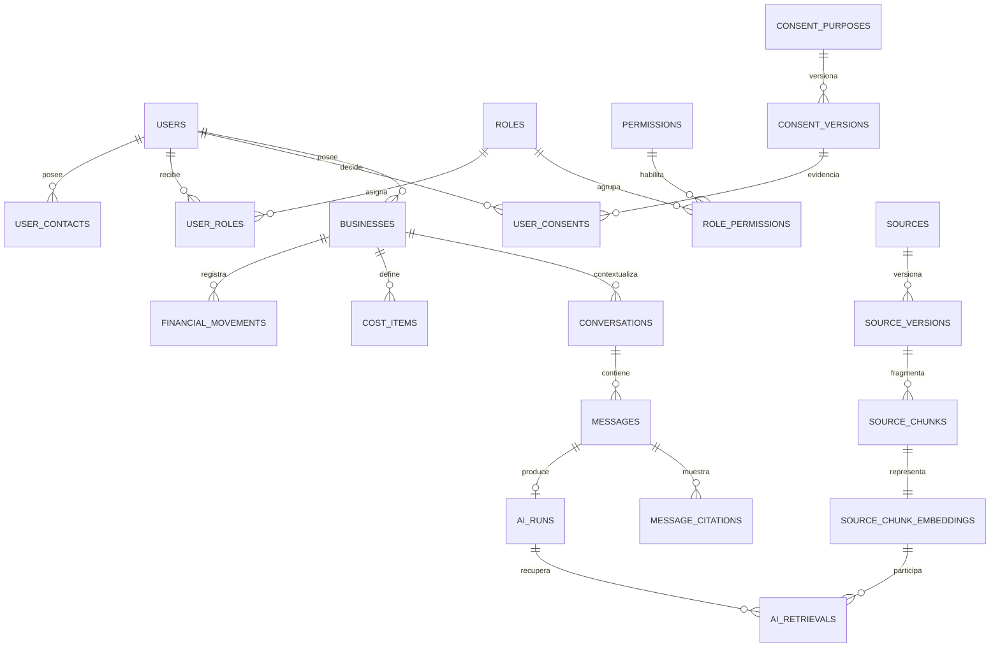

# Arquitectura y diccionario de datos

## Vista de dominios

## Relaciones centrales

## Diccionario resumido

| Dominio | Tablas | Finalidad y retención |
|---|---|---|
| Identidad | `users`, `user_contacts`, `password_credentials`, `auth_challenges`, `sessions` | Cuenta, verificación y sesiones. Los retos vencidos y sesiones revocadas se purgan periódicamente. |
| Autorización | `roles`, `permissions`, `role_permissions`, `user_roles` | RBAC extensible. La administradora no recibe permisos sobre contenido privado. |
| Organizaciones | `organizations`, `organization_memberships` | Preparación técnica para una futura modalidad institucional; sin interfaz en el MVP. |
| Preferencias | `user_preferences` | Accesibilidad, voz y longitud de respuesta. |
| Emprendimiento | `businesses`, `business_memberships`, `skills`, `business_skills`, `business_goals`, `business_channels` | Perfil general sin domicilio exacto. Eliminación lógica y purga en 30 días. |
| Diagnóstico | `diagnostic_sessions`, `diagnostic_answers`, `formalization_routes`, `formalization_steps` | Diagnóstico educativo y ruta basada en fuentes. Respuestas abiertas cifradas. |
| Privacidad | `consent_purposes`, `consent_versions`, `user_consents`, `data_export_requests`, `deletion_requests` | Consentimiento versionado, exportación y supresión verificable. |
| Finanzas | `financial_categories`, `financial_movements`, `cost_items`, `pricing_scenarios`, `pricing_scenario_costs` | Libro simple y cálculos reproducibles. Notas cifradas; transferencias excluidas del resultado. |
| Conversación | `conversations`, `messages`, `ai_runs`, `ai_retrievals`, `message_citations`, `response_feedback` | Historial propio, trazabilidad RAG y retroalimentación. Texto cifrado. |
| Contenido y voz | `generated_contents`, `audio_artifacts`, `escalation_events` | Borradores con aprobación explícita, audio temporal y ayuda profesional/oficial. |
| RAG | `source_publishers`, `sources`, `source_versions`, `source_status_history`, `ingestion_jobs`, `source_chunks`, `embedding_models`, `source_chunk_embeddings`, `source_checks` | Corpus público versionado, búsqueda híbrida y retiro sin borrar historial. |
| Operación | `audit_events`, `security_alerts`, `system_settings`, `background_jobs` | Auditoría inmutable, alertas y trabajos. Auditoría seudonimizada: 12 meses; seguridad: 90 días. |
| Evaluación | `evaluation_sets`, `evaluation_cases`, `evaluation_runs`, `evaluation_results` | Pruebas de recuperación, citas, advertencias y abstención. |
| Investigación | `research_participants`, `usability_sessions`, `task_results`, `survey_responses` | Piloto separado mediante códigos seudónimos y consentimiento específico. |

## Reglas de eliminación

1. La eliminación lógica oculta inmediatamente el dato en la aplicación.
2. Un trabajo de purga elimina datos derivados y objetos externos en un máximo de 30 días.
3. El audio se elimina al confirmar la transcripción o al alcanzar 24 horas.
4. Las copias de respaldo expiran a los 30 días.
5. La auditoría conserva identificadores seudonimizados, nunca texto de conversaciones ni notas financieras.

